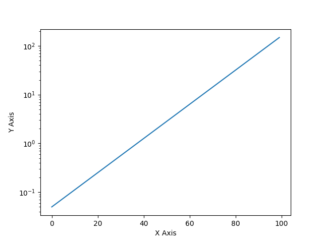
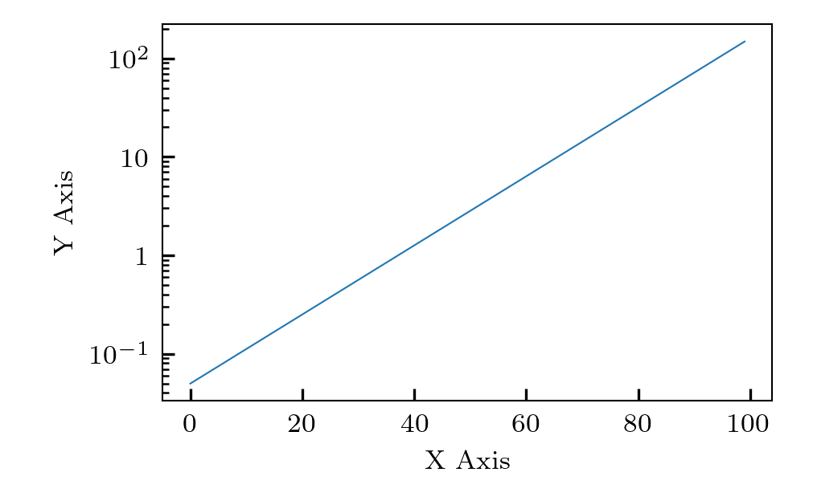

# cosmoplots
Routines to get a sane default configuration for production quality plots. Used by complex systems modelling group at UiT.

# Installation
```
pip install cosmoplots
```
# Use
Set your `rcparams` before plotting in your code, for example:
```Python
from cosmoplots import figure_defs

axes_size = figure_defs.set_rcparams_aip(plt.rcParams, num_cols=1, ls="thin")
```

## `change_log_axis_base`

```python
import matplotlib.pyplot as plt
import numpy as np
import cosmoplots

axes_size = cosmoplots.set_rcparams_aip(plt.rcParams, num_cols=1, ls="thin")
a = np.exp(np.linspace(-3, 5, 100))
# 1 --- Semilogx
fig = plt.figure()
ax = fig.add_axes(axes_size)
ax.set_xlabel(r"$\textnormal{X Axis}$")
ax.set_ylabel(r"$\textnormal{Y Axis}$")
base = 2  # Default is 10, but 2 works equally well
cosmoplots.change_log_axis_base(ax, "x", base=base)
# Do plotting ...
# If you use "plot", the change_log_axis_base can be called at the top (along with add_axes
# etc.), but using loglog, semilogx, semilogy will re-set, and the change_log_axis_base
# function must be called again.
ax.plot(a)
plt.show()
```

## `matplotlib` vs. `cosmoplots` defaults

```python
import matplotlib.pyplot as plt
import numpy as np
import cosmoplots

# Matplotlib --------------------------------------------------------------------------- #
a = np.exp(np.linspace(-3, 5, 100))
fig = plt.figure()
ax = fig.add_subplot()
ax.set_xlabel("X Axis")
ax.set_ylabel("Y Axis")
ax.semilogy(a)
# plt.savefig("assets/vanilla_y.png")
plt.show()

# Cosmoplots --------------------------------------------------------------------------- #
axes_size = cosmoplots.set_rcparams_aip(plt.rcParams, num_cols=1, ls="thin")
a = np.exp(np.linspace(-3, 5, 100))
fig = plt.figure()
ax = fig.add_axes(axes_size)
ax.set_xlabel(r"$\textnormal{X Axis}$")
ax.set_ylabel(r"$\textnormal{Y Axis}$")
cosmoplots.change_log_axis_base(ax, "y")
ax.semilogy(a)
# Commenting out the below line result in the default base10 ticks
cosmoplots.change_log_axis_base(ax, "y")
# plt.savefig("assets/cosmoplots_y.png")
plt.show()
```

From the code snippet above, the default `matplotlib` implementation creates:



while the defaults set by `cosmoplots` give:



| `matplotlib` | `cosmoplots` |
| :--------: | :--------: |
|  |  |
