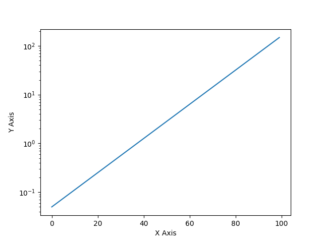
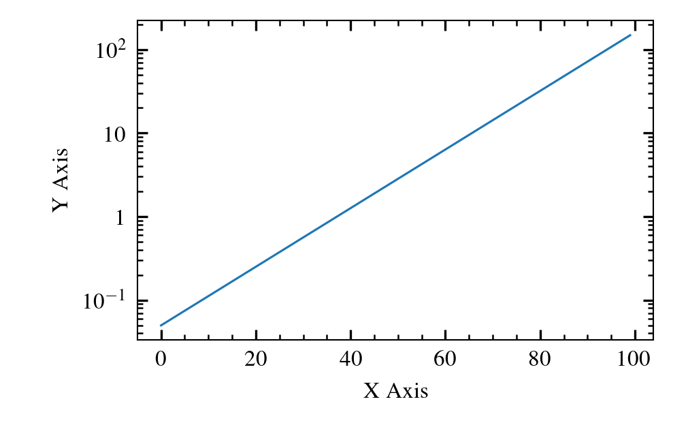

# cosmoplots
Routines to get a sane default configuration for production quality plots. Used by complex systems modelling group at UiT.

# Installation

The package is published to PyPI and can be installed with

```sh
pip install cosmoplots
```

If you want the development version you must first clone the repo to your local machine,
then install the project and its dependencies with [poetry]:

```sh
git clone https://github.com/uit-cosmo/cosmoplots.git
poetry install
```

# Use

Set your `rcparams` before plotting in your code, for example:

```Python
import cosmoplots

axes_size = cosmoplots.set_rcparams_dynamo(plt.rcParams, num_cols=1, ls="thin")
```

## `change_log_axis_base`

```python
import matplotlib.pyplot as plt
import numpy as np
import cosmoplots

axes_size = cosmoplots.set_rcparams_dynamo(plt.rcParams, num_cols=1, ls="thin")
a = np.exp(np.linspace(-3, 5, 100))
fig = plt.figure()
ax = fig.add_axes(axes_size)
ax.set_xlabel("X Axis")
ax.set_ylabel("Y Axis")
base = 2  # Default is 10, but 2 works equally well
cosmoplots.change_log_axis_base(ax, "x", base=base)
# Do plotting ...
# If you use "plot", the change_log_axis_base can be called at the top (along with add_axes
# etc.), but using loglog, semilogx, semilogy will re-set, and the change_log_axis_base
# function must be called again.
ax.plot(a)
plt.show()
```

## `matplotlib` vs. `cosmoplots` defaults

```python
import matplotlib.pyplot as plt
import numpy as np
import cosmoplots

# Matplotlib --------------------------------------------------------------------------- #
a = np.exp(np.linspace(-3, 5, 100))
fig = plt.figure()
ax = fig.add_subplot()
ax.set_xlabel("X Axis")
ax.set_ylabel("Y Axis")
ax.semilogy(a)
# plt.savefig("assets/matplotlib.png")
plt.show()

# Cosmoplots --------------------------------------------------------------------------- #
axes_size = cosmoplots.set_rcparams_dynamo(plt.rcParams, num_cols=1, ls="thin")
a = np.exp(np.linspace(-3, 5, 100))
fig = plt.figure()
ax = fig.add_axes(axes_size)
ax.set_xlabel("X Axis")
ax.set_ylabel("Y Axis")
cosmoplots.change_log_axis_base(ax, "y")
ax.semilogy(a)
# Commenting out the below line result in the default base10 ticks
cosmoplots.change_log_axis_base(ax, "y")
# plt.savefig("assets/cosmoplots.png")
plt.show()
```

| `matplotlib` | `cosmoplots` |
| :--------: | :--------: |
|  |  |

<!-- Links -->
[poetry]: https://python-poetry.org
