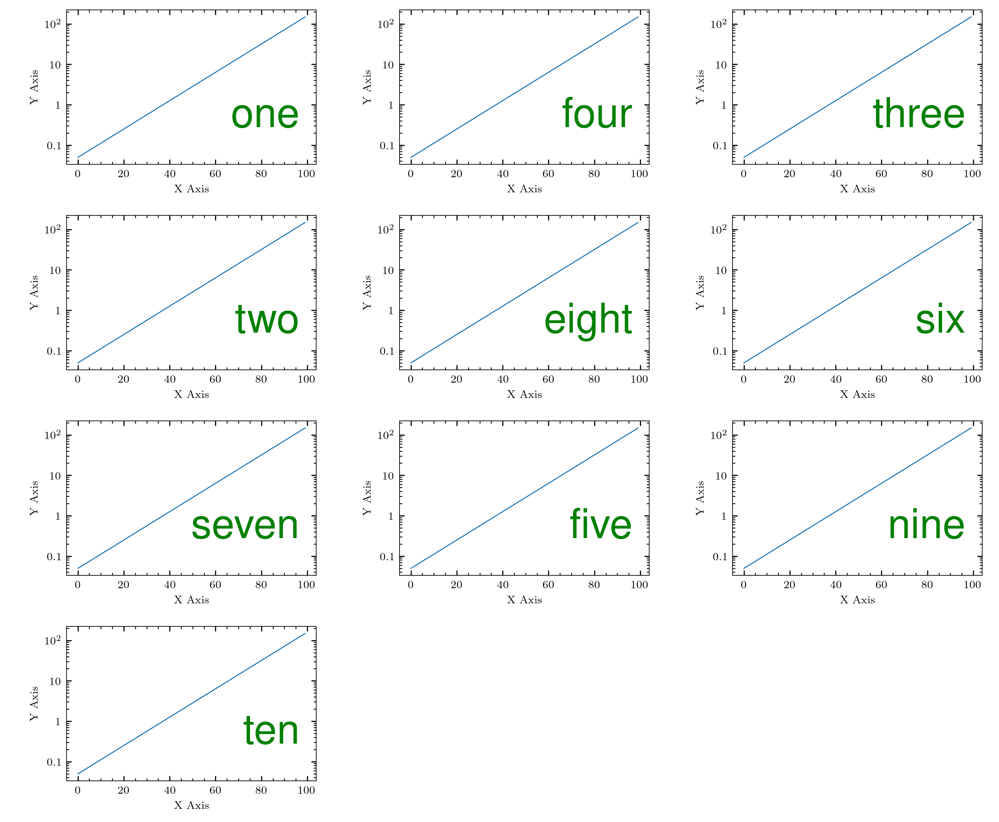

# cosmoplots

Routines to get a sane default configuration for production quality plots. Used by complex systems modelling group at UiT.

## Installation

The package is published to PyPI and can be installed with

```sh
pip install cosmoplots
```

If you want the development version you must first clone the repo to your local machine,
then install the project and its dependencies with [poetry]:

```sh
git clone https://github.com/uit-cosmo/cosmoplots.git
cd cosmoplots
poetry install
```

### LaTeX and Latin Modern dependency

The default style uses LaTeX to render text and equations. The default font is Latin Modern.

```python
text.usetex : True
font.family : "Latin Modern"
```

Installations of [TeX Live](https://www.tug.org/texlive/) should include Latin Modern, but it may be manually downloaded from
[here](https://www.gust.org.pl/projects/e-foundry/latin-modern).

## Usage

Set your `rcparams` before plotting in your code, for example:

```python
import matplotlib.pyplot as plt
import cosmoplots
# If you only want the default style
plt.style.use(["cosmoplots.default"])
```

### Muliple subfigures

To make a figure with multiple rows or columns, use `cosmoplots.figure_multiple_rows_columns`.
By default, the labels are $\mathrm{(a)}$, $\mathrm{(b)}$, $\mathrm{(c)}$, ..., but they may be replaced using the `labels` argument.

```python
import matplotlib.pyplot as plt
import cosmoplots
plt.style.use(["cosmoplots.default"])

import numpy as np

rows = 1
columns = 2

fig, ax = cosmoplots.figure_multiple_rows_columns(rows, columns)
a = np.linspace(-3,3,100)
for i in range(rows*columns):
    ax[i].set_xlabel("X Axis")
    ax[i].set_ylabel("Y Axis")
    ax[i].plot(i*a)
# plt.savefig("assets/multifig.png")
plt.show()
```


## `change_log_axis_base`

```python
import matplotlib.pyplot as plt
import cosmoplots
plt.style.use(["cosmoplots.default"])
import numpy as np

a = np.exp(np.linspace(-3, 1, 100))

# Plotting
fig = plt.figure()
ax1 = plt.gca()
ax1.set_xlabel("X Axis")
ax1.set_ylabel("Y Axis")
base = 2  # Default is 10, but 2 works equally well
# Do plotting ...
ax1.semilogx(a)
# It is recommended to call the change_log_axis_base function after doing all the
# plotting. By default, it will try to infer the scaling used for the axis and only
# adjust accordingly.
cosmoplots.change_log_axis_base(ax1, base=base)
# Plotting
fig = plt.figure()
ax2 = plt.gca()
ax2.set_xlabel("X Axis")
ax2.set_ylabel("Y Axis")
base = 2  # Default is 10, but 2 works equally well
cosmoplots.change_log_axis_base(ax2, "x", base=base)
# Do plotting ...
# If you use "plot", the change_log_axis_base can be called at the top (along with add_axes
# etc.), but using loglog, semilogx, semilogy will re-set, and the change_log_axis_base
# function must be called again.
ax2.plot(a)
plt.show()
```

## `matplotlib` vs. `cosmoplots` defaults

```python
import matplotlib.pyplot as plt
import cosmoplots
import numpy as np

def plot() -> None:
    a = np.exp(np.linspace(-3, 5, 100))
    fig = plt.figure()
    ax = fig.add_subplot()
    ax.set_xlabel("X Axis")
    ax.set_ylabel("Y Axis")
    ax.semilogy(a)

# Matplotlib ------------------------------------------------------------------------- #
with plt.style.context("default"):
    plot()
    # plt.savefig("assets/matplotlib.png")
    plt.show()

# Cosmoplots ------------------------------------------------------------------------- #
with plt.style.context("cosmoplots.default"):
    plot()
    # plt.savefig("assets/cosmoplots.png")
    plt.show()
```

| `matplotlib` | `cosmoplots` |
| :--------: | :--------: |
|  |  |

## `generate_hex_colors`

This function generates the hex numbers for the colours extracted from a `matplotlib` colour map based on the number of points of interest.
The colors change gradually from bright to dark or vice versa.

```python
import matplotlib.pyplot as plt
import cosmoplots
plt.style.use(["cosmoplots.default"])


color_list = cosmoplots.generate_hex_colors(5, 'viridis', show_swatch=True, ascending=True)
# plt.savefig("./assets/hex_colors.png")

# Print color_list to retrieve the hex numbers
print(color_list) #['#fde725', '#5ec962', '#21918c', '#3b528b', '#440154']

fig = plt.figure()
ax = plt.gca()
for i, color in enumerate(color_list):
    ax.plot([1,2],[i,i+1], c = color)

# plt.savefig("./assets/hex_colors_example.png")
plt.show()
```

| `hex_colors.png` | hex_colors_example.png |
| :--------: | :--------: |
|  |  |

## `combine`

Sometimes, plots might be related and better placed as subfigures in a larger figure. If
combining the plots using the `subfigure` environment in latex or similar is not an
option, this is easily done with [`imagemagick`](https://imagemagick.org/index.php) in a
systematic way.

> [!caution]
>
> This uses `imagemagick v7`.

The `Combine` class within the `concat` module implements such procedures, and is also
conveniently available from the `combine` function in `cosmoplots`.

An example is shown below. Also see the [`tests`](./tests/) directory for more examples.
A `help` method that prints the `imagemagick` commands that are used under the hood is
also available.

```python
import matplotlib.pyplot as plt
import cosmoplots
plt.style.use("cosmoplots.default")
import numpy as np


def plot(i) -> None:
    """Create a simple plot."""
    a = np.exp(np.linspace(-3, 5, 100))
    fig = plt.figure()
    ax = fig.add_subplot()
    ax.set_xlabel("X Axis")
    ax.set_ylabel("Y Axis")
    ax.semilogy(a)
    plt.savefig(f"./assets/{i}.png")
    plt.close(fig)

plot(1)
plot(2)
plot(3)
plot(4)
plot(5)
plot(6)
plot(7)
plot(8)
plot(9)
plot(10)
# See `magick -list font` for all available fonts.
figs = [f"./assets/{i}.png" for i in range(1, 11)]
cosmoplots.combine(*figs).using(
    font="JetBrainsMonoNL-NFM-Medium",
    fontsize=30,
    gravity="southeast",
    pos=(100, 200),
    color="green",
).in_grid(w=3, h=4).with_labels(  # Specifying labels is optional
    "one", "four", "three", "two", "eight", "six", "seven", "five", "nine", "ten"
).save("./assets/concat.png")

# Note that cosmoplots.combine() == cosmoplots.Combine().combine()
cosmoplots.combine().help()
# Or equivalently
cosmoplots.Combine().help()
```


