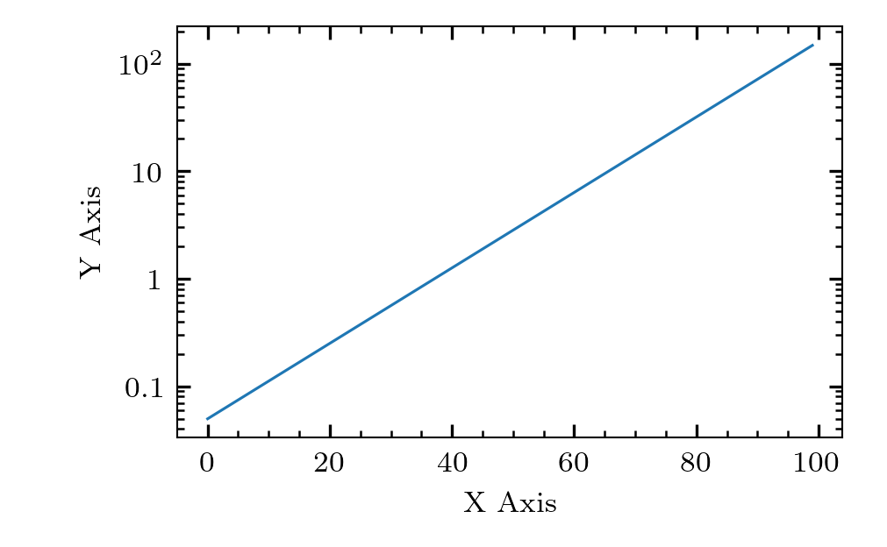

# cosmoplots

Routines to get a sane default configuration for production quality plots. Used by complex systems modelling group at UiT.

## Installation

The package is published to PyPI and can be installed with

```sh
pip install cosmoplots
```

If you want the development version you must first clone the repo to your local machine,
then install the project and its dependencies with [poetry]:

```sh
git clone https://github.com/uit-cosmo/cosmoplots.git
cd cosmoplots
poetry install
```

## Usage

Set your `rcparams` before plotting in your code, for example:

```python
import cosmoplots
import matplotlib as mpl

# If you only want the default style
mpl.style.use("cosmoplots.default")
# If you want the two column style, combine it with the default. Setting it after is
# important, since values from the default is overridden.
mpl.style.use(["cosmoplots.default", "cosmoplots.two_columns"])
```

## `change_log_axis_base`

```python
import matplotlib.pyplot as plt
import numpy as np
import cosmoplots
import matplotlib as mpl

mpl.style.use("cosmoplots.default")
a = np.exp(np.linspace(-3, 5, 100))
fig = plt.figure()
ax = plt.gca()
ax.set_xlabel("X Axis")
ax.set_ylabel("Y Axis")
base = 2  # Default is 10, but 2 works equally well
cosmoplots.change_log_axis_base(ax, "x", base=base)
# Do plotting ...
# If you use "plot", the change_log_axis_base can be called at the top (along with add_axes
# etc.), but using loglog, semilogx, semilogy will re-set, and the change_log_axis_base
# function must be called again.
ax.plot(a)
plt.show()
```

## `matplotlib` vs. `cosmoplots` defaults

```python
import cosmoplots
import matplotlib as mpl
import matplotlib.pyplot as plt
import numpy as np

def plot() -> None:
    a = np.exp(np.linspace(-3, 5, 100))
    fig = plt.figure()
    ax = fig.add_subplot()
    ax.set_xlabel("X Axis")
    ax.set_ylabel("Y Axis")
    ax.semilogy(a)

# Matplotlib ------------------------------------------------------------------------- #
with mpl.style.context("default"):
    plot()
    # plt.savefig("assets/matplotlib.png")
    plt.show()

# Cosmoplots ------------------------------------------------------------------------- #
with mpl.style.context("cosmoplots.default"):
    plot()
    # plt.savefig("assets/cosmoplots.png")
    plt.show()
```

| `matplotlib` | `cosmoplots` |
| :--------: | :--------: |
|  |  |

<!-- Links -->
[poetry]: https://python-poetry.org


## `generate_hex_colors`

This function generates the hex numbers for the colours extracted from a `matplotlib` colour map based on the number of points of interest.
The colors change gradually from bright to dark or vice versa.
```python
import matplotlib.pyplot as plt
import cosmoplots

axes_size = cosmoplots.set_rcparams_dynamo(plt.rcParams, num_cols=1, ls="thin")


color_list = cosmoplots.generate_hex_colors(5, 'viridis', show_swatch=True, ascending=True)
plt.savefig("./assets/hex_colors.png")

# Print color_list to retrieve the hex numbers
print(color_list) #['#fde725', '#5ec962', '#21918c', '#3b528b', '#440154']

fig = plt.figure()
ax = fig.add_axes(axes_size)
for i, color in enumerate(color_list):
    ax.plot([1,2],[i,i+1], c = color)

plt.savefig("./assets/hex_colors_example.png")
plt.show()
```
| `hex_colors.png` | hex_colors_example.png |
| :--------: | :--------: | 
|  |  |

## `combine`

Sometimes, plots might be related and better placed as subfigures in a larger figure. If
combining the plots using the `subfigure` environment in latex or similar is not an
option, this is easily done with [`imagemagick`](https://imagemagick.org/index.php) in a
systematic way.

The `Combine` class within the `concat` module implements such procedures, and is also
conveniently available from the `combine` function in `cosmoplots`.

An example is shown below. Also see the [`tests`](./tests/) directory for more examples.

```python
import matplotlib as mpl
import matplotlib.pyplot as plt
import numpy as np

import cosmoplots

mpl.style.use("cosmoplots.default")


def plot(i) -> None:
    """Create a simple plot."""
    a = np.exp(np.linspace(-3, 5, 100))
    fig = plt.figure()
    ax = fig.add_subplot()
    ax.set_xlabel("X Axis")
    ax.set_ylabel("Y Axis")
    ax.semilogy(a)
    plt.savefig(f"{i}.png")
    plt.close(fig)

plot(1)
plot(2)
plot(3)
plot(4)
plot(5)
plot(6)
plot(7)
plot(8)
plot(9)
plot(10)
# See `convert -list font` for all available fonts.
cosmoplots.combine(
    "1.png", "2.png", "3.png", "4.png", "5.png",
    "6.png", "7.png", "8.png", "9.png", "10.png",
).using(
    font="JetBrainsMonoNL-NFM-Medium",
    fontsize=60,
    gravity="southeast",
    pos=(100, 200),
    color="green",
).in_grid(w=3, h=4).with_labels(
    "one", "four", "three", "two", "eight", "six", "seven", "five", "nine", "ten"
).save("out.png")
```
